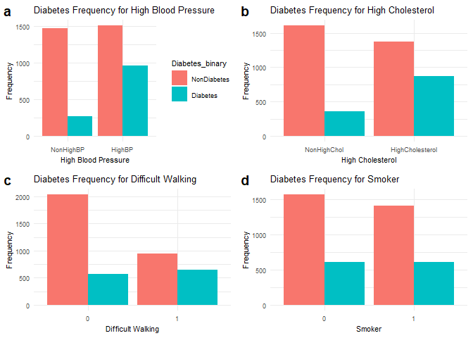

ST558_Project3
================
Hui Fang and Joy Zhou
2023-11-02

# Introduction

Diabetes is a seriously pervasive chronic disease that disrupts the
body’s ability to regulate blood glucose levels, leading to a diminished
quality of life and reduced life expectancy. It stands as one of the
most prevalent chronic illnesses in the United States, impacting
millions of Americans annually and imposing a significant economic
burden on the nation.

In this project, we will use the `diabetes binary health indicators`
dataset obtained from
[Kaggle](https://www.kaggle.com/datasets/alexteboul/diabetes-health-indicators-dataset/)
to conduct comprehensive exploratory data analysis (EDA) and develop
predictive models. This dataset comprises 253,680 survey responses to
the CDC’s BRFSS (Behavioral Risk Factor Surveillance System) from year
2015. The primary target variable, `Diabetes_binary`, offers binary
classification, distinguishing between 0 for no diabetes, and 1 for
prediabetes or diabetes. This dataset encompasses 21 feature variables
and is not balanced. Detailed information of variable can be found
[here](https://www.kaggle.com/datasets/alexteboul/diabetes-health-indicators-dataset/?select=diabetes_binary_health_indicators_BRFSS2015.csv).

Our analysis will primarily focus on a subset of key variables,
including High blood pressure (HighBP), High cholesterol (HighChol),
cholesterol check (CholCheck), Body Mass Index (BMI), Smoker, Fruits,
Veggies, and Age.  
In our EDA phase, we will start by summarizing basic statistics
visualizing variable frequencies. This will be followed by the
exploration of correlations between variables and the creation of
contingency tables to better understand the interplay of these factors.

Based on the results from EDA, we will split the dataset into training
(70%) and test (30%) subsets for each educational level. Subsequently,
we will employ the training data to fit six distinct models, including a
logistic regression, a LASSO logistic regression, a classification tree
model, a random forest model, a `partial least squares model`, as well
as a `regularized logistic regression model`. The performance of these
models will be rigorously evaluated using the test dataset, and we will
determine the most effective model for predicting diabetes outcomes.

Description of variables in the data set:  
+ Diabetes_binary: 0 = no diabetes 1 = prediabetes or diabetes  
+ HighBP: High blood pressure  
+ HighChol: High cholesterol  
+ CholCheck: 0 = no cholesterol check in 5 years 1 = yes cholesterol
check in 5 years  
+ BMI: Body Mass Index  
+ Smoker: Have you smoked at least 100 cigarettes in your entire life? 0
= no 1 = yes  
+ Stroke: 0 = no 1 = yes  
+ HeartDiseaseorAttack: coronary heart disease (CHD) or myocardial
infarction (MI) 0 = no 1 = yes  
+ PhysActivity: physical activity in past 30 days - not including job 0
= no 1 = yes  
+ Fruits: Consume Fruit 1 or more times per day 0 = no 1 = yes  
+ Veggies: Consume Vegetables 1 or more times per day 0 = no 1 = yes  
+ HvyAlcoholConsump: (adult men \>=14 drinks per week and adult
women\>=7 drinks per week) 0 = no 1 = yes  
+ AnyHealthcare: Health care coverage 0 = no 1 = yes  
+ NoDocbcCost: Was there a time in the past 12 months when you needed to
see a doctor but could not because of cost? 0 = no 1 = yes  
+ GenHlth: in general your health is: scale 1-5 1 = excellent 2 = very
good 3 = good 4 = fair 5 = poor  
+ MentHlth: days of poor mental health scale 1-30 days  
+ PhysHlth: physical illness or injury days in past 30 days scale 1-30  
+ DiffWalk: Do you have serious difficulty walking or climbing stairs? 0
= no 1 = yes  
+ Sex: 0 = female 1 = male  
+ Age: 13-level age category 1 = 18-24 2 = 25-29 3 = 30-34 4 = 35-39 5 =
40-44 6 = 45-49 7 = 50-54 8 = 55-59 9 = 60-64 10 = 65-69 11 = 70-74 12 =
75-79 13 = 80 or older  
+ Education: scale 1-6 1 = Never attended school or only kindergarten 2
= Grades 1 through 8 (Elementary) 3 = Grades 9 through 11 (Some high
school) 4 = Grade 12 or GED (High school graduate) 5 = College 1 year to
3 years (Some college or technical school) 6 = College 4 years or more
(College graduate)  
+ Income: scale 1-8 1 = less than \$10,000 5 = less than \$35,000 8 =
\$75,000 or more

# Data

## Read in data

``` r
library(dplyr)
library(readr)
diabetes <- as_tibble(read.csv("diabetes_binary_health_indicators_BRFSS2015.csv", header = TRUE))
head(diabetes)
```

    ## # A tibble: 6 × 22
    ##   Diabetes_binary HighBP HighChol CholCheck   BMI Smoker Stroke
    ##             <dbl>  <dbl>    <dbl>     <dbl> <dbl>  <dbl>  <dbl>
    ## 1               0      1        1         1    40      1      0
    ## 2               0      0        0         0    25      1      0
    ## 3               0      1        1         1    28      0      0
    ## 4               0      1        0         1    27      0      0
    ## 5               0      1        1         1    24      0      0
    ## 6               0      1        1         1    25      1      0
    ## # ℹ 15 more variables: HeartDiseaseorAttack <dbl>, PhysActivity <dbl>,
    ## #   Fruits <dbl>, Veggies <dbl>, HvyAlcoholConsump <dbl>, AnyHealthcare <dbl>,
    ## #   NoDocbcCost <dbl>, GenHlth <dbl>, MentHlth <dbl>, PhysHlth <dbl>,
    ## #   DiffWalk <dbl>, Sex <dbl>, Age <dbl>, Education <dbl>, Income <dbl>

## grouping Education levels

``` r
diabetes$Education <- ifelse(diabetes$Education %in% c(1, 2), "SomeElementary",
                         ifelse(diabetes$Education == 3, "SomeHighSchool", 
                              ifelse(diabetes$Education == 4, "HighSchool",
                                   ifelse(diabetes$Education == 5, "SomeCollege",
                                        ifelse(diabetes$Education == 6, "College", NA)))))

params$Edu
```

    ## [1] "SomeElementary"

## Subsetting the dataset based on education level

``` r
EducationData <- filter(diabetes, (Education == params$Edu))
```

# EDA

## Checking the missing values

``` r
missing_values <- colSums(is.na(EducationData))
```

## Summary statistics for numeric variables

``` r
library(dplyr)
# Filter only numeric variables
numeric_vars <- EducationData %>% select_if(is.numeric)
# Create a summary table
summary_table <- numeric_vars %>%
  sapply(function(x) {
    c( count = sum(!is.na(x)),
      mean = mean(x, na.rm = TRUE),
      std = sd(x, na.rm = TRUE),
      min = min(x, na.rm = TRUE),
      Q1 = quantile(x, 0.25, na.rm = TRUE),
      median = median(x, na.rm = TRUE),
      Q3 = quantile(x, 0.75, na.rm = TRUE),
      max = max(x, na.rm = TRUE)
    )
  })
# Transpose the summary table
transposed_summary_table <- t(round(summary_table, 2)) 
colnames(transposed_summary_table) <- c("count", "mean", "std", 
                                        "min", "Q1", "median", "Q3", "max")
# Print the transposed table
knitr::kable(transposed_summary_table)
```

|                      | count |  mean |   std | min |  Q1 | median |  Q3 | max |
|:---------------------|------:|------:|------:|----:|----:|-------:|----:|----:|
| Diabetes_binary      |  4217 |  0.29 |  0.45 |   0 |   0 |      0 |   1 |   1 |
| HighBP               |  4217 |  0.59 |  0.49 |   0 |   0 |      1 |   1 |   1 |
| HighChol             |  4217 |  0.53 |  0.50 |   0 |   0 |      1 |   1 |   1 |
| CholCheck            |  4217 |  0.97 |  0.17 |   0 |   1 |      1 |   1 |   1 |
| BMI                  |  4217 | 29.46 |  7.05 |  12 |  25 |     28 |  33 |  84 |
| Smoker               |  4217 |  0.48 |  0.50 |   0 |   0 |      0 |   1 |   1 |
| Stroke               |  4217 |  0.09 |  0.28 |   0 |   0 |      0 |   0 |   1 |
| HeartDiseaseorAttack |  4217 |  0.19 |  0.39 |   0 |   0 |      0 |   0 |   1 |
| PhysActivity         |  4217 |  0.57 |  0.50 |   0 |   0 |      1 |   1 |   1 |
| Fruits               |  4217 |  0.58 |  0.49 |   0 |   0 |      1 |   1 |   1 |
| Veggies              |  4217 |  0.69 |  0.46 |   0 |   0 |      1 |   1 |   1 |
| HvyAlcoholConsump    |  4217 |  0.03 |  0.16 |   0 |   0 |      0 |   0 |   1 |
| AnyHealthcare        |  4217 |  0.84 |  0.37 |   0 |   1 |      1 |   1 |   1 |
| NoDocbcCost          |  4217 |  0.18 |  0.38 |   0 |   0 |      0 |   0 |   1 |
| GenHlth              |  4217 |  3.47 |  1.11 |   1 |   3 |      4 |   4 |   5 |
| MentHlth             |  4217 |  5.22 |  9.77 |   0 |   0 |      0 |   5 |  30 |
| PhysHlth             |  4217 |  8.37 | 11.61 |   0 |   0 |      1 |  15 |  30 |
| DiffWalk             |  4217 |  0.38 |  0.49 |   0 |   0 |      0 |   1 |   1 |
| Sex                  |  4217 |  0.46 |  0.50 |   0 |   0 |      0 |   1 |   1 |
| Age                  |  4217 |  9.11 |  2.97 |   1 |   7 |     10 |  12 |  13 |
| Income               |  4217 |  3.31 |  1.94 |   1 |   2 |      3 |   5 |   8 |

The center and spread of each variable can be found in this table.

## Check the correlation between `Diabetes_binary` and the other variables

``` r
library(knitr)
# Create a correlation matrix between variables
Cor_Matrix <- EducationData %>% 
         select(Diabetes_binary, BMI, GenHlth, MentHlth, PhysHlth, Age, Income) %>%
         cor()

# Round the correlation matrix to two decimal places
rounded_Cor_Matrix <- round(Cor_Matrix, digits = 2)
# Print the rounded correlation matrix
kable(rounded_Cor_Matrix)
```

|                 | Diabetes_binary |   BMI | GenHlth | MentHlth | PhysHlth |   Age | Income |
|:----------------|----------------:|------:|--------:|---------:|---------:|------:|-------:|
| Diabetes_binary |            1.00 |  0.17 |    0.26 |     0.10 |     0.16 |  0.16 |  -0.15 |
| BMI             |            0.17 |  1.00 |    0.10 |     0.07 |     0.08 | -0.12 |  -0.05 |
| GenHlth         |            0.26 |  0.10 |    1.00 |     0.31 |     0.51 |  0.08 |  -0.26 |
| MentHlth        |            0.10 |  0.07 |    0.31 |     1.00 |     0.40 | -0.08 |  -0.15 |
| PhysHlth        |            0.16 |  0.08 |    0.51 |     0.40 |     1.00 |  0.07 |  -0.19 |
| Age             |            0.16 | -0.12 |    0.08 |    -0.08 |     0.07 |  1.00 |  -0.12 |
| Income          |           -0.15 | -0.05 |   -0.26 |    -0.15 |    -0.19 | -0.12 |   1.00 |

## Visualization of correlation with `Diabetes_binary` through bar graph

``` r
# Load required libraries
library(ggplot2)
# Exclude the character variable from the data
data <- EducationData[, !(names(EducationData) %in% "Education")]

# Calculate the correlation of each variable with 'Diabetes_binary'
correlations <- sapply(data[-1], function(x) cor(x, data$Diabetes_binary))

# Create a data frame for the correlations
correlation_data <- data.frame(Variable = names(correlations), Correlation = correlations)

# Create a bar chart of correlations
ggplot(correlation_data, aes(x = Variable, y = Correlation)) +
  geom_bar(stat = "identity", fill = "orange") +
  labs(title = "Correlation with Diabetes_binary", x = "Variable", y = "Correlation") +
  theme(axis.text.x = element_text(angle = 45, hjust = 1)) 
```

<!-- -->

``` r
  # coord_flip()  # Rotate the x-axis labels for better readability
```

In this chart, some of the variables exhibited positive correlations
with ‘Diabetes_binary,’ while others showed negative correlations with
it.

## Convert some variables to factor

``` r
EducationData$Diabetes_binary <- factor(EducationData$Diabetes_binary, 
                                       levels = c(0, 1),
                                       labels = c("NonDiabetes", "Diabetes"))
# EducationData$Income <- as.factor(EducationData$Income)
EducationData$HighBP <- factor(EducationData$HighBP,
                               levels = c(0, 1),
                               labels = c("NonHighBP", "HighBP"))
EducationData$HighChol <- factor(EducationData$HighChol,levels = c(0, 1),
                                 labels = c("NonHighChol", "HighCholesterol"))
EducationData$Sex <- factor(EducationData$Sex,levels = c(0, 1), 
                            labels = c("Female", "Male"))
EducationData$Fruits <- factor(EducationData$Fruits,levels = c(0, 1), 
                              labels = c("No", "Yes"))
EducationData$Veggies <- factor(EducationData$Veggies,levels = c(0, 1),
                                labels = c("No", "Yes"))
EducationData$CholCheck <- as.factor(EducationData$CholCheck)
EducationData$Smoker <- factor(EducationData$Smoker, levels = c(0, 1),
                                labels = c("No", "Yes"))
EducationData$Stroke <- as.factor(EducationData$Stroke)
EducationData$HeartDiseaseorAttack <- as.factor(EducationData$HeartDiseaseorAttack)
EducationData$PhysActivity <- factor(EducationData$PhysActivity, levels = c(0, 1),
                                       labels = c("No", "Yes"))
EducationData$HvyAlcoholConsump <- as.factor(EducationData$HvyAlcoholConsump)
EducationData$AnyHealthcare <- as.factor(EducationData$AnyHealthcare)
EducationData$NoDocbcCost <- as.factor(EducationData$NoDocbcCost)
EducationData$DiffWalk <- factor(EducationData$DiffWalk, levels = c(0, 1),
                                       labels = c("No", "Yes"))
# EducationData$GenHlth <- factor(EducationData$GenHlth, 
#                                 levels = c(1, 2, 3, 4, 5),
#                                 labels = c("Excellent", "Very good", "Good", "Fair", "Poor"))
```

## Summary statistics for Character variables

``` r
library(knitr)
# one-way table
kable(table(EducationData$Diabetes_binary))
```

| Var1        | Freq |
|:------------|-----:|
| NonDiabetes | 2987 |
| Diabetes    | 1230 |

``` r
kable(table(EducationData$HighBP))
```

| Var1      | Freq |
|:----------|-----:|
| NonHighBP | 1740 |
| HighBP    | 2477 |

``` r
# two-way table
kable(table(EducationData$Diabetes_binary, EducationData$HighChol))
```

|             | NonHighChol | HighCholesterol |
|:------------|------------:|----------------:|
| NonDiabetes |        1611 |            1376 |
| Diabetes    |         354 |             876 |

``` r
kable(table(EducationData$Diabetes_binary, EducationData$Fruits))
```

|             |   No |  Yes |
|:------------|-----:|-----:|
| NonDiabetes | 1247 | 1740 |
| Diabetes    |  538 |  692 |

``` r
kable(table(EducationData$Diabetes_binary, EducationData$Veggies))
```

|             |  No |  Yes |
|:------------|----:|-----:|
| NonDiabetes | 889 | 2098 |
| Diabetes    | 406 |  824 |

``` r
kable(table(EducationData$Diabetes_binary, EducationData$Sex))
```

|             | Female | Male |
|:------------|-------:|-----:|
| NonDiabetes |   1576 | 1411 |
| Diabetes    |    707 |  523 |

``` r
# Three-way table
kable(table(EducationData$Diabetes_binary, EducationData$HighBP, EducationData$Sex))
```

| Var1        | Var2      | Var3   | Freq |
|:------------|:----------|:-------|-----:|
| NonDiabetes | NonHighBP | Female |  748 |
| Diabetes    | NonHighBP | Female |  143 |
| NonDiabetes | HighBP    | Female |  828 |
| Diabetes    | HighBP    | Female |  564 |
| NonDiabetes | NonHighBP | Male   |  724 |
| Diabetes    | NonHighBP | Male   |  125 |
| NonDiabetes | HighBP    | Male   |  687 |
| Diabetes    | HighBP    | Male   |  398 |

## Graphical Summaries

### Bar plots

``` r
library(ggplot2)
library(cowplot)
# Checking The relation B/W HighBP and Diabetes
g1 <- ggplot(data = EducationData, aes(x = HighBP, y = after_stat(count), 
                                       fill = Diabetes_binary)) +
             geom_bar(position = "dodge") +
             labs(title = "Diabetes Frequency for High Blood Pressure",
                  x = "High Blood Pressure",
                  y = "Frequency") + theme_minimal() +
            theme(text = element_text(size = 8)) 
# Checking The relation B/W HighChol and Diabetes
g2 <- ggplot(data = EducationData, aes(x = HighChol, y = after_stat(count), 
                                       fill = Diabetes_binary)) +
             geom_bar(position = "dodge") +
               labs(title = "Diabetes Frequency for High Cholesterol",
                    x = "High Cholesterol",
                    y = "Frequency") + theme_minimal() +

            theme(legend.position = "none",
                  text = element_text(size = 8)) # Hide the legend
g3 <- ggplot(data = EducationData, aes(x = DiffWalk, y = after_stat(count), 
                                       fill = Diabetes_binary)) +
             geom_bar(position = "dodge") +
             labs(title = "Diabetes Frequency for Difficult Walking",
                  x = "Difficult Walking",
                  y = "Frequency") + theme_minimal() +
            theme(legend.position = "none",
                  text = element_text(size = 8)) # Hide the legend
g4 <- ggplot(data = EducationData, aes(x = Smoker, y = after_stat(count), 
                                       fill = Diabetes_binary)) +
             geom_bar(position = "dodge") +
             labs(title = "Diabetes Frequency for Smoker",
                  x = "Smoker",
                  y = "Frequency")  + theme_minimal() +
            theme(legend.position = "none",
                  text = element_text(size = 8)) # Hide the legend           
# Arrange the plots into a 2x2 gird using cowplot
combined_plots <- plot_grid(g1, g2, g3, g4,
                            ncol = 2,
                            labels = c("a", "b", "c", "d"))
# Print the combined plots
combined_plots
```

<!-- -->

``` r
library(ggplot2)
# Define labels for 'GenHlth'
genhlth_labels <- c("Excellent", "Very Good", "Good", "Fair", "Poor")

# Create a plot with two facets (subplots)
g5 <- ggplot(EducationData, aes(x = factor(GenHlth, levels = 1:5, labels = genhlth_labels), 
                               fill = Diabetes_binary)) +
  geom_bar(position = 'dodge', alpha = 0.5, width = 0.5) +
  facet_wrap(~ Diabetes_binary, ncol = 2) +
  labs(title = 'General Health Conditions Distribution', x = NULL, y = 'Count') +
  theme_minimal() +
  theme(legend.title = element_blank()) +
  theme(legend.position = "none", axis.text.x = element_text(size = 8))
g5
```

<!-- --> BMI
distribution

``` r
g6 <- ggplot(data = EducationData, aes(x = BMI, y = after_stat(count), 
                                       fill = Diabetes_binary)) +
             geom_bar() +
             labs(title = "BMI distribution",
                  x = "BMI",
                  y = "Count")  + theme_minimal() +
            theme(legend.position = "none",
                  text = element_text(size = 8)) 
g6
```

<!-- -->

### Box plots

``` r
library(gridExtra)
```

    ## 
    ## Attaching package: 'gridExtra'

    ## The following object is masked from 'package:dplyr':
    ## 
    ##     combine

``` r
g7 <- ggplot(EducationData, aes(x = Diabetes_binary, y = BMI, fill = Diabetes_binary)) +
     geom_boxplot() +
     labs(title = "BMI Distribution vs. Diabetes",
       x = "Diabetes_binary",
       y = "BMI") +
     theme(text = element_text(size = 8)) 
g8 <- ggplot(EducationData, aes(x = Diabetes_binary, y = Age, fill = Diabetes_binary)) +
      geom_boxplot() +
  labs(title = "Age Distribution vs. Diabetes",
       x = "Diabetes_binary",
       y = "Age") +
  theme(text = element_text(size = 8)) 
g9 <- ggplot(EducationData, aes(x = Diabetes_binary, y = Income, fill = Diabetes_binary)) +
      geom_boxplot() +
  labs(title = "Income Distribution vs. Diabetes",
       x = "Diabetes_binary",
       y = "Income") +
  theme(text = element_text(size = 8))
g10 <- ggplot(EducationData, aes(x = Diabetes_binary, y = MentHlth, fill = Diabetes_binary)) +
      geom_boxplot() +
  labs(title = "Mental Health Distribution vs. Diabetes",
       x = "Diabetes_binary",
       y = "Mental Health") +
  theme(text = element_text(size = 8)) 
# Arrange the plots into a 2x2 gird using cowplot
complots <- plot_grid(g7, g8, g9, g10,
                            ncol = 2,
                            labels = c("a", "b", "c", "d"))
# Print the combined plots
complots
```

<!-- --> \### Density
plots

``` r
g11 <- ggplot(EducationData, aes(x = Income)) +
           geom_density(adjust = 0.5, alpha = 0.5, 
                        aes(fill = Diabetes_binary), position = "stack") +
          labs(title = "Distribution of Income vs. Diabetes",
               x = "Diabetes_binary",
               y = "Density") +
          theme(legend.position = "none", 
                text = element_text(size = 8))
  
g12 <- ggplot(EducationData, aes(x = Age)) +
           geom_density(adjust = 0.5, alpha = 0.5, 
                        aes(fill = Diabetes_binary), position = "stack") +
          labs(title = "Distribution of Age vs. Diabetes",
               x = "Age",
               y = "Density") +
  theme(text = element_text(size = 8))
# Arrange the plots into a 2x2 gird using cowplot
complots <- plot_grid(g11, g12, ncol = 2,
                      labels = c("a", "b"))
# Print the combined plots
complots
```

<!-- -->
