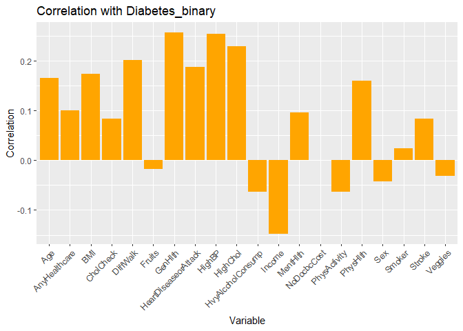
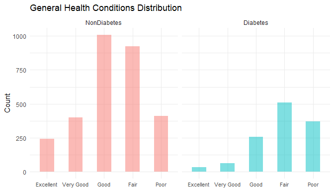
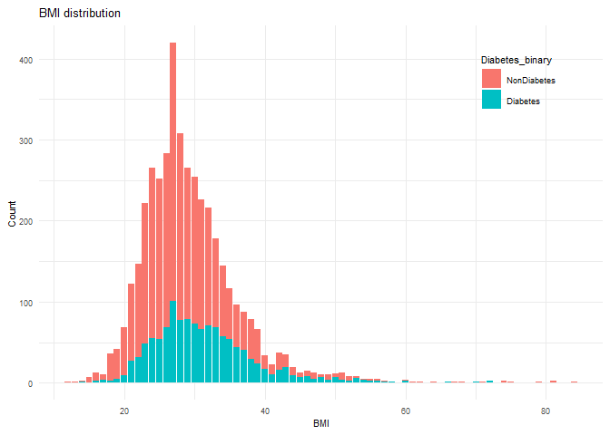
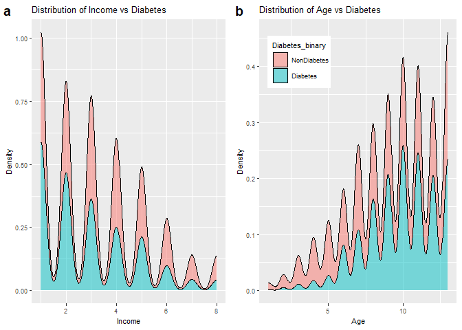
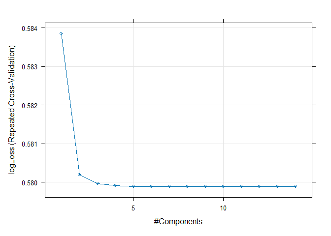
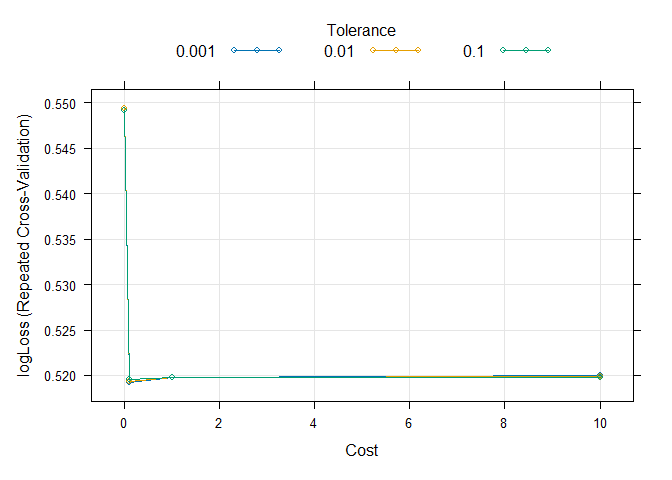

ST558_Project3
================
Hui and Joy
2023-11-02

# Introduction

Diabetes is a seriously pervasive chronic disease that disrupts the
body’s ability to regulate blood glucose levels, leading to a diminished
quality of life and reduced life expectancy. It stands as one of the
most prevalent chronic illnesses in the United States, impacting
millions of Americans annually and imposing a significant economic
burden on the nation.

In this project, we will use the `diabetes binary health indicators`
dataset obtained from
[Kaggle](https://www.kaggle.com/datasets/alexteboul/diabetes-health-indicators-dataset/)
to conduct comprehensive exploratory data analysis (EDA) and develop
predictive models. This dataset comprises 253,680 survey responses to
the CDC’s BRFSS (`Behavioral Risk Factor Surveillance System`) from year
2015. The primary target variable, `Diabetes_binary`, offers binary
classification, distinguishing between 0 for no diabetes, and 1 for
prediabetes or diabetes. This dataset encompasses 21 feature variables
and is not balanced. Detailed information of variable can be found
[here](https://www.kaggle.com/datasets/alexteboul/diabetes-health-indicators-dataset/?select=diabetes_binary_health_indicators_BRFSS2015.csv).

Our analysis will primarily focus on a subset of key variables,
including High blood pressure (HighBP), High cholesterol (HighChol),
cholesterol check (CholCheck), Body Mass Index (BMI), Smoker, Fruits,
Veggies, and Age.  
In our EDA phase, we will start by summarizing basic statistics
visualizing variable frequencies. This will be followed by the
exploration of correlations between variables and the creation of
contingency tables to better understand the interplay of these factors.

Based on the results from EDA, we will split the dataset into training
(70%) and test (30%) subsets for each educational level. Subsequently,
we will employ the training data to fit six distinct models, including a
logistic regression, a LASSO logistic regression, a classification tree
model, a random forest model, a `partial least squares model`, as well
as a `regularized logistic regression model`. The performance of these
models will be rigorously evaluated using the test dataset, and we will
determine the most effective model for predicting diabetes outcomes.

Description of variables in the data set:  
+ Diabetes_binary: 0 = no diabetes 1 = prediabetes or diabetes  
+ HighBP: High blood pressure  
+ HighChol: High cholesterol  
+ CholCheck: 0 = no cholesterol check in 5 years 1 = yes cholesterol
check in 5 years  
+ BMI: Body Mass Index  
+ Smoker: Have you smoked at least 100 cigarettes in your entire life? 0
= no 1 = yes  
+ Stroke: 0 = no 1 = yes  
+ HeartDiseaseorAttack: coronary heart disease (CHD) or myocardial
infarction (MI) 0 = no 1 = yes  
+ PhysActivity: physical activity in past 30 days - not including job 0
= no 1 = yes  
+ Fruits: Consume Fruit 1 or more times per day 0 = no 1 = yes  
+ Veggies: Consume Vegetables 1 or more times per day 0 = no 1 = yes  
+ HvyAlcoholConsump: (adult men \>=14 drinks per week and adult
women\>=7 drinks per week) 0 = no 1 = yes  
+ AnyHealthcare: Health care coverage 0 = no 1 = yes  
+ NoDocbcCost: Was there a time in the past 12 months when you needed to
see a doctor but could not because of cost? 0 = no 1 = yes  
+ GenHlth: in general your health is: scale 1-5 1 = excellent 2 = very
good 3 = good 4 = fair 5 = poor  
+ MentHlth: days of poor mental health scale 1-30 days  
+ PhysHlth: physical illness or injury days in past 30 days scale 1-30  
+ DiffWalk: Do you have serious difficulty walking or climbing stairs? 0
= no 1 = yes  
+ Sex: 0 = female 1 = male  
+ Age: 13-level age category 1 = 18-24 2 = 25-29 3 = 30-34 4 = 35-39 5 =
40-44 6 = 45-49 7 = 50-54 8 = 55-59 9 = 60-64 10 = 65-69 11 = 70-74 12 =
75-79 13 = 80 or older  
+ Education: scale 1-6 1 = Never attended school or only kindergarten 2
= Grades 1 through 8 (Elementary) 3 = Grades 9 through 11 (Some high
school) 4 = Grade 12 or GED (High school graduate) 5 = College 1 year to
3 years (Some college or technical school) 6 = College 4 years or more
(College graduate)  
+ Income: scale 1-8 1 = less than \$10,000 5 = less than \$35,000 8 =
\$75,000 or more

# Data

## Read in data

``` r
library(dplyr)
library(readr)
diabetes <- as_tibble(read.csv("diabetes_binary_health_indicators_BRFSS2015.csv", header = TRUE))
head(diabetes)
```

    ## # A tibble: 6 × 22
    ##   Diabetes_binary HighBP HighChol CholCheck   BMI Smoker Stroke
    ##             <dbl>  <dbl>    <dbl>     <dbl> <dbl>  <dbl>  <dbl>
    ## 1               0      1        1         1    40      1      0
    ## 2               0      0        0         0    25      1      0
    ## 3               0      1        1         1    28      0      0
    ## 4               0      1        0         1    27      0      0
    ## 5               0      1        1         1    24      0      0
    ## 6               0      1        1         1    25      1      0
    ## # ℹ 15 more variables: HeartDiseaseorAttack <dbl>, PhysActivity <dbl>,
    ## #   Fruits <dbl>, Veggies <dbl>, HvyAlcoholConsump <dbl>, AnyHealthcare <dbl>,
    ## #   NoDocbcCost <dbl>, GenHlth <dbl>, MentHlth <dbl>, PhysHlth <dbl>,
    ## #   DiffWalk <dbl>, Sex <dbl>, Age <dbl>, Education <dbl>, Income <dbl>

## Grouping education levels

``` r
diabetes$Education <- ifelse(diabetes$Education %in% c(1, 2), "SomeElementary",
                         ifelse(diabetes$Education == 3, "SomeHighSchool", 
                              ifelse(diabetes$Education == 4, "HighSchool",
                                   ifelse(diabetes$Education == 5, "SomeCollege",
                                        ifelse(diabetes$Education == 6, "College", NA)))))

params$Edu
```

    ## [1] "SomeElementary"

## Subsetting the dataset based on education level

``` r
EducationData <- filter(diabetes, (Education == params$Edu))
```

# Explanatory Data Analyzes

### Checking the missing values

``` r
sum(is.na(EducationData))
```

    ## [1] 0

### CHecking the structure of `EducationData`

``` r
str(EducationData)
```

    ## tibble [4,217 × 22] (S3: tbl_df/tbl/data.frame)
    ##  $ Diabetes_binary     : num [1:4217] 0 1 1 1 0 0 1 0 1 0 ...
    ##  $ HighBP              : num [1:4217] 1 1 0 1 1 1 1 1 1 0 ...
    ##  $ HighChol            : num [1:4217] 1 1 1 1 0 1 1 1 0 1 ...
    ##  $ CholCheck           : num [1:4217] 1 1 1 1 1 1 1 1 1 1 ...
    ##  $ BMI                 : num [1:4217] 38 28 32 25 35 45 25 37 30 36 ...
    ##  $ Smoker              : num [1:4217] 1 1 0 1 1 1 1 1 0 0 ...
    ##  $ Stroke              : num [1:4217] 0 0 0 0 0 0 0 0 0 0 ...
    ##  $ HeartDiseaseorAttack: num [1:4217] 0 1 1 1 0 1 0 0 0 0 ...
    ##  $ PhysActivity        : num [1:4217] 0 0 1 0 1 1 0 1 1 0 ...
    ##  $ Fruits              : num [1:4217] 1 0 0 1 1 1 0 1 0 0 ...
    ##  $ Veggies             : num [1:4217] 1 1 0 1 1 1 0 1 0 1 ...
    ##  $ HvyAlcoholConsump   : num [1:4217] 0 0 0 0 0 0 0 0 0 0 ...
    ##  $ AnyHealthcare       : num [1:4217] 1 1 1 1 1 1 1 1 1 0 ...
    ##  $ NoDocbcCost         : num [1:4217] 0 0 0 0 0 1 0 0 0 1 ...
    ##  $ GenHlth             : num [1:4217] 5 4 1 5 4 5 4 3 3 4 ...
    ##  $ MentHlth            : num [1:4217] 15 0 0 15 0 5 3 0 0 0 ...
    ##  $ PhysHlth            : num [1:4217] 30 0 0 30 1 10 6 0 7 30 ...
    ##  $ DiffWalk            : num [1:4217] 1 0 1 1 1 1 1 0 1 0 ...
    ##  $ Sex                 : num [1:4217] 0 1 0 0 1 0 1 0 0 1 ...
    ##  $ Age                 : num [1:4217] 13 12 13 9 9 7 12 11 10 5 ...
    ##  $ Education           : chr [1:4217] "SomeElementary" "SomeElementary" "SomeElementary" "SomeElementary" ...
    ##  $ Income              : num [1:4217] 3 4 2 3 5 2 2 2 3 3 ...

### Summary statistics for numeric variables

``` r
library(dplyr)
# Filter only numeric variables
numeric_vars <- EducationData %>% select_if(is.numeric)
# Create a summary table
summary_table <- numeric_vars %>%
  sapply(function(x) {
    c( count = sum(!is.na(x)),
      mean = mean(x, na.rm = TRUE),
      std = sd(x, na.rm = TRUE),
      min = min(x, na.rm = TRUE),
      Q1 = quantile(x, 0.25, na.rm = TRUE),
      median = median(x, na.rm = TRUE),
      Q3 = quantile(x, 0.75, na.rm = TRUE),
      max = max(x, na.rm = TRUE)
    )
  })
# Transpose the summary table
transposed_summary_table <- t(round(summary_table, 2)) 
colnames(transposed_summary_table) <- c("count", "mean", "std", 
                                        "min", "Q1", "median", "Q3", "max")
# Print the transposed table
knitr::kable(transposed_summary_table)
```

|                      | count |  mean |   std | min |  Q1 | median |  Q3 | max |
|:---------------------|------:|------:|------:|----:|----:|-------:|----:|----:|
| Diabetes_binary      |  4217 |  0.29 |  0.45 |   0 |   0 |      0 |   1 |   1 |
| HighBP               |  4217 |  0.59 |  0.49 |   0 |   0 |      1 |   1 |   1 |
| HighChol             |  4217 |  0.53 |  0.50 |   0 |   0 |      1 |   1 |   1 |
| CholCheck            |  4217 |  0.97 |  0.17 |   0 |   1 |      1 |   1 |   1 |
| BMI                  |  4217 | 29.46 |  7.05 |  12 |  25 |     28 |  33 |  84 |
| Smoker               |  4217 |  0.48 |  0.50 |   0 |   0 |      0 |   1 |   1 |
| Stroke               |  4217 |  0.09 |  0.28 |   0 |   0 |      0 |   0 |   1 |
| HeartDiseaseorAttack |  4217 |  0.19 |  0.39 |   0 |   0 |      0 |   0 |   1 |
| PhysActivity         |  4217 |  0.57 |  0.50 |   0 |   0 |      1 |   1 |   1 |
| Fruits               |  4217 |  0.58 |  0.49 |   0 |   0 |      1 |   1 |   1 |
| Veggies              |  4217 |  0.69 |  0.46 |   0 |   0 |      1 |   1 |   1 |
| HvyAlcoholConsump    |  4217 |  0.03 |  0.16 |   0 |   0 |      0 |   0 |   1 |
| AnyHealthcare        |  4217 |  0.84 |  0.37 |   0 |   1 |      1 |   1 |   1 |
| NoDocbcCost          |  4217 |  0.18 |  0.38 |   0 |   0 |      0 |   0 |   1 |
| GenHlth              |  4217 |  3.47 |  1.11 |   1 |   3 |      4 |   4 |   5 |
| MentHlth             |  4217 |  5.22 |  9.77 |   0 |   0 |      0 |   5 |  30 |
| PhysHlth             |  4217 |  8.37 | 11.61 |   0 |   0 |      1 |  15 |  30 |
| DiffWalk             |  4217 |  0.38 |  0.49 |   0 |   0 |      0 |   1 |   1 |
| Sex                  |  4217 |  0.46 |  0.50 |   0 |   0 |      0 |   1 |   1 |
| Age                  |  4217 |  9.11 |  2.97 |   1 |   7 |     10 |  12 |  13 |
| Income               |  4217 |  3.31 |  1.94 |   1 |   2 |      3 |   5 |   8 |

The center and spread of each variable can be found in this table.

### Check the correlation between Diabetes_binary and the other variables

``` r
library(knitr)
# Create a correlation matrix between variables
Cor_Matrix <- EducationData %>% 
         select(Diabetes_binary, BMI, MentHlth, PhysHlth, Age, Income) %>%
         cor()

# Round the correlation matrix to two decimal places
rounded_Cor_Matrix <- round(Cor_Matrix, digits = 2)
# Print the rounded correlation matrix
kable(rounded_Cor_Matrix)
```

|                 | Diabetes_binary |   BMI | MentHlth | PhysHlth |   Age | Income |
|:----------------|----------------:|------:|---------:|---------:|------:|-------:|
| Diabetes_binary |            1.00 |  0.17 |     0.10 |     0.16 |  0.16 |  -0.15 |
| BMI             |            0.17 |  1.00 |     0.07 |     0.08 | -0.12 |  -0.05 |
| MentHlth        |            0.10 |  0.07 |     1.00 |     0.40 | -0.08 |  -0.15 |
| PhysHlth        |            0.16 |  0.08 |     0.40 |     1.00 |  0.07 |  -0.19 |
| Age             |            0.16 | -0.12 |    -0.08 |     0.07 |  1.00 |  -0.12 |
| Income          |           -0.15 | -0.05 |    -0.15 |    -0.19 | -0.12 |   1.00 |

### Visualization of correlation with `Diabetes_binary` through bar graph

``` r
# Load required libraries
library(ggplot2)
# Exclude the character variable from the data
data <- EducationData[, !(names(EducationData) %in% "Education")]

# Calculate the correlation of each variable with 'Diabetes_binary'
correlations <- sapply(data[-1], function(x) cor(x, data$Diabetes_binary))

# Create a data frame for the correlations
correlation_data <- data.frame(Variable = names(correlations), Correlation = correlations)

# Create a bar chart of correlations
ggplot(correlation_data, aes(x = Variable, y = Correlation)) +
  geom_bar(stat = "identity", fill = "orange") +
  labs(title = "Correlation with Diabetes_binary", x = "Variable", y = "Correlation") +
  theme(axis.text.x = element_text(angle = 45, hjust = 1)) 
```

<!-- -->

``` r
  # coord_flip()  # Rotate the x-axis labels for better readability
```

In this chart, some of the variables exhibited positive correlations
with ‘Diabetes_binary,’ while others showed negative correlations with
it.

### Convert some variables to factor

``` r
EducationData$Diabetes_binary <- factor(EducationData$Diabetes_binary, 
                                       levels = c(0, 1),
                                       labels = c("NonDiabetes", "Diabetes"))
EducationData$Income <- as.factor(EducationData$Income)
EducationData$Education <- as.factor(EducationData$Education)
EducationData$HighBP <- factor(EducationData$HighBP,
                               levels = c(0, 1),
                               labels = c("NonHighBP", "HighBP"))
EducationData$HighChol <- factor(EducationData$HighChol,levels = c(0, 1),
                                 labels = c("NonHighChol", "HighCholesterol"))
EducationData$Sex <- factor(EducationData$Sex,levels = c(0, 1), 
                            labels = c("Female", "Male"))
EducationData$Fruits <- factor(EducationData$Fruits,levels = c(0, 1), 
                              labels = c("No", "Yes"))
EducationData$Veggies <- factor(EducationData$Veggies,levels = c(0, 1),
                                labels = c("No", "Yes"))
EducationData$CholCheck <- as.factor(EducationData$CholCheck)
EducationData$Smoker <- as.factor(EducationData$Smoker)
EducationData$Stroke <- as.factor(EducationData$Stroke)
EducationData$HeartDiseaseorAttack <- as.factor(EducationData$HeartDiseaseorAttack)
EducationData$PhysActivity <- factor(EducationData$PhysActivity, levels = c(0, 1),
                                       labels = c("No", "Yes"))
EducationData$HvyAlcoholConsump <- as.factor(EducationData$HvyAlcoholConsump)
EducationData$AnyHealthcare <- as.factor(EducationData$AnyHealthcare)
EducationData$NoDocbcCost <- as.factor(EducationData$NoDocbcCost)
EducationData$DiffWalk <- factor(EducationData$DiffWalk, levels = c(0, 1),
                                       labels = c("No", "Yes"))
```

### Summary statistics for Character variables

``` r
# one-way table
kable(table(EducationData$Diabetes_binary))
```

| Var1        | Freq |
|:------------|-----:|
| NonDiabetes | 2987 |
| Diabetes    | 1230 |

``` r
kable(table(EducationData$HighBP))
```

| Var1      | Freq |
|:----------|-----:|
| NonHighBP | 1740 |
| HighBP    | 2477 |

``` r
# two-way table
kable(table(EducationData$Diabetes_binary, EducationData$HighChol))
```

|             | NonHighChol | HighCholesterol |
|:------------|------------:|----------------:|
| NonDiabetes |        1611 |            1376 |
| Diabetes    |         354 |             876 |

``` r
kable(table(EducationData$Diabetes_binary, EducationData$Fruits))
```

|             |   No |  Yes |
|:------------|-----:|-----:|
| NonDiabetes | 1247 | 1740 |
| Diabetes    |  538 |  692 |

``` r
kable(table(EducationData$Diabetes_binary, EducationData$Veggies))
```

|             |  No |  Yes |
|:------------|----:|-----:|
| NonDiabetes | 889 | 2098 |
| Diabetes    | 406 |  824 |

``` r
kable(table(EducationData$Diabetes_binary, EducationData$Sex))
```

|             | Female | Male |
|:------------|-------:|-----:|
| NonDiabetes |   1576 | 1411 |
| Diabetes    |    707 |  523 |

``` r
# Three-way table
kable(table(EducationData$Diabetes_binary, EducationData$HighBP, EducationData$Sex))
```

| Var1        | Var2      | Var3   | Freq |
|:------------|:----------|:-------|-----:|
| NonDiabetes | NonHighBP | Female |  748 |
| Diabetes    | NonHighBP | Female |  143 |
| NonDiabetes | HighBP    | Female |  828 |
| Diabetes    | HighBP    | Female |  564 |
| NonDiabetes | NonHighBP | Male   |  724 |
| Diabetes    | NonHighBP | Male   |  125 |
| NonDiabetes | HighBP    | Male   |  687 |
| Diabetes    | HighBP    | Male   |  398 |

## Graphical Summaries

### Bar plots

``` r
library(ggplot2)
library(cowplot)
# Checking The relation B/W HighBP and Diabetes
g1 <- ggplot(data = EducationData, aes(x = HighBP, y = after_stat(count), 
                                       fill = Diabetes_binary)) +
             geom_bar(position = "dodge") +
             labs(title = "Diabetes Frequency for High Blood Pressure",
                  x = "High Blood Pressure",
                  y = "Frequency") + theme_minimal() +
            theme(text = element_text(size = 8)) 
# Checking The relation B/W HighChol and Diabetes
g2 <- ggplot(data = EducationData, aes(x = HighChol, y = after_stat(count), 
                                       fill = Diabetes_binary)) +
             geom_bar(position = "dodge") +
               labs(title = "Diabetes Frequency for High Cholesterol",
                    x = "High Cholesterol",
                    y = "Frequency") + theme_minimal() +

            theme(legend.position = "none",
                  text = element_text(size = 8)) # Hide the legend
g3 <- ggplot(data = EducationData, aes(x = DiffWalk, y = after_stat(count), 
                                       fill = Diabetes_binary)) +
             geom_bar(position = "dodge") +
             labs(title = "Diabetes Frequency for Difficult Walking",
                  x = "Difficult Walking",
                  y = "Frequency") + theme_minimal() +
            theme(legend.position = "none",
                  text = element_text(size = 8)) # Hide the legend
g4 <- ggplot(data = EducationData, aes(x = Smoker, y = after_stat(count), 
                                       fill = Diabetes_binary)) +
             geom_bar(position = "dodge") +
             labs(title = "Diabetes Frequency for Smoker",
                  x = "Smoker",
                  y = "Frequency")  + theme_minimal() +
            theme(legend.position = "none",
                  text = element_text(size = 8)) # Hide the legend           
# Arrange the plots into a 2x2 gird using cowplot
combined_plots <- plot_grid(g1, g2, g3, g4,
                            ncol = 2,
                            labels = c("a", "b", "c", "d"))
# Print the combined plots
combined_plots
```

<!-- -->

``` r
library(ggplot2)
# Define labels for 'GenHlth'
genhlth_labels <- c("Excellent", "Very Good", "Good", "Fair", "Poor")

# Create a plot with two facets (subplots)
g5 <- ggplot(EducationData, aes(x = factor(GenHlth, levels = 1:5, labels = genhlth_labels), 
                               fill = Diabetes_binary)) +
  geom_bar(position = 'dodge', alpha = 0.5, width = 0.5) +
  facet_wrap(~ Diabetes_binary, ncol = 2) +
  labs(title = 'General Health Conditions Distribution', x = NULL, y = 'Count') +
  theme_minimal() +
  theme(legend.title = element_blank()) +
  theme(legend.position = "none", axis.text.x = element_text(size = 8))
g5
```

<!-- --> BMI
distribution

``` r
g6 <- ggplot(data = EducationData, aes(x = BMI, y = after_stat(count), 
                                       fill = Diabetes_binary)) +
             geom_bar() +
             labs(title = "BMI distribution",
                  x = "BMI",
                  y = "Count")  + theme_minimal() +
             theme(text = element_text(size = 8)
             ) 
g6
```

<!-- -->

### Box plots

``` r
library(gridExtra)
```

    ## 
    ## Attaching package: 'gridExtra'

    ## The following object is masked from 'package:dplyr':
    ## 
    ##     combine

``` r
g7 <- ggplot(EducationData, aes(x = Diabetes_binary, y = BMI, 
                                fill = Diabetes_binary)) +
     geom_boxplot() +
     labs(title = "BMI Distribution vs. Diabetes",
       x = "Diabetes_binary",
       y = "BMI") +
     theme(text = element_text(size = 8)) 
g8 <- ggplot(EducationData, aes(x = Diabetes_binary, y = Age, 
                                fill = Diabetes_binary)) +
      geom_boxplot() +
      labs(title = "Age Distribution vs. Diabetes",
           x = "Diabetes_binary",
           y = "Age") +
      theme(text = element_text(size = 8)) 
g9 <- ggplot(EducationData, aes(x = Diabetes_binary, y = Income, 
                                fill = Diabetes_binary)) +
      geom_boxplot() +
      labs(title = "Income Distribution vs. Diabetes",
           x = "Diabetes_binary",
           y = "Income") +
      theme(text = element_text(size = 8))
g10 <- ggplot(EducationData, aes(x = Diabetes_binary, y = MentHlth, 
                                 fill = Diabetes_binary)) +
       geom_boxplot() +
        labs(title = "Mental Health Distribution vs. Diabetes",
        x = "Diabetes_binary",
        y = "Mental Health") +
        theme(text = element_text(size = 8)) 
# Arrange the plots into a 2x2 gird using cowplot
complots <- plot_grid(g7, g8, g9, g10, ncol = 2,
                      labels = c("a", "b", "c", "d"))
# Print the combined plots
complots
```

<!-- --> \### Density
plots

``` r
g11 <- ggplot(EducationData, aes(x = Income)) +
          geom_density(adjust = 0.5, alpha = 0.5, 
                        aes(fill = Diabetes_binary), position = "stack") +
          labs(title = "Distribution of Income vs. Diabetes",
               x = "Diabetes_binary",
               y = "Density") +
          theme(legend.position = "none", 
                text = element_text(size = 8))
  
g12 <- ggplot(EducationData, aes(x = Age)) +
          geom_density(adjust = 0.5, alpha = 0.5, 
                        aes(fill = Diabetes_binary), position = "stack") +
          labs(title = "Distribution of Age vs. Diabetes",
               x = "Age",
               y = "Density") +
          theme(text = element_text(size = 8))
# Arrange the plots into a 2x2 gird using cowplot
complots <- plot_grid(g11, g12, ncol = 2,
                      labels = c("a", "b"))
# Print the combined plots
complots
```

<!-- -->

# Modeling

## Split the data

``` r
library(caret)
library(lattice)

# Set seed for reproducibility
set.seed(110)

# Create a data partition for training (70%) and testing (30%) data
intrain <- createDataPartition(y = EducationData$Diabetes_binary,
                                 p = 0.70,
                                 list = FALSE
                                 )
# Create the training data set using the partition
train_set <- EducationData[intrain,]

# Create the testing data set using he partition
test_set <- EducationData[-intrain,]
```

## Summarize and fit models

### What is **log loss** and why may we prefer it to things like accuracy?

**Log loss**, also known as logistic loss or cross-entropy loss, is a
loss function used in classification problems to evaluate the
performance of a model, especially in scenarios with binary response
variables. It quantifies the performance of a model by measuring the
difference between the predicted probability distribution produced by
the model and the actual probability distribution. Log loss is
calculated as the negative logarithm of the predicted probability
assigned to the true class label. It penalizes the model for incorrect
predictions and a lower log loss value indicates better model predictive
performance.

**Accuracy**, on the other hand, is a metric used to evaluate
classification model performance by measuring the percentage of
correctly classified instances. While accuracy is a useful metric, it
can be misleading in some cases. For example, in imbalanced datasets
where one class significantly outweighs the other, a model that always
predicts the majority class will yield high accuracy but may not be
practically useful. In such cases, log loss can offer a more reliable
metric as it considers the model’s predictions uncertainty.

In summary, log loss is a preferred metric over accuracy when the data
is imbalanced or when the cost of false positives and false negatives is
different.

### Logistic Regression Model

- What is a **logistic regression** and why we apply it to this kind of
  data?

A **logistic regression model** is a statistical method used for
analyzing the relationship between a binary outcome variable and one or
more predictor variables. It is commonly used in classification
problems, where the goal is to predict one of two possible outcomes,
typically represented as 0 and 1 or “Yes” and “No”.

The relationship between response variable and the predictor variables
is evaluated using the logistic function (also known as the sigmoid
function), which ensures that the predicted probabilities fall between 0
and 1. The model parameters are estimated using a process called maximum
likelihood estimation. The key output of a logistic regression model
includes the coefficients (log-odds) associated with each predictor
variable, which describe the strength and direction of their influence
on the probability of the outcome.

Logistic regression is designed to handle categorical dependent
variables. In our situation, Diabetes_binary is a binary variable and is
suitable for fitting logistic regression model.

- Fit Logistic Regression Models

``` r
library(caret)
library(Metrics)
```

    ## 
    ## Attaching package: 'Metrics'

    ## The following objects are masked from 'package:caret':
    ## 
    ##     precision, recall

``` r
# Set seed for reproducibility
set.seed(111)

# Fit the logistic regression models
log_reg1 <- train(Diabetes_binary ~ HighBP + HighChol + CholCheck + 
                    Smoker + Fruits + Veggies + Sex + Income, 
               data = train_set, 
               family = "binomial",
               method = "glm",
               preProcess = c("center", "scale"),
               trControl = trainControl(method = "cv", number = 5),
               metric = "Accuracy",  
               trace = FALSE
               )

log_reg2 <- train(Diabetes_binary ~ HighBP*HighChol*CholCheck + 
                    Smoker + Fruits + Veggies + Sex + Income, 
               data = train_set, 
               family = "binomial",
               method = "glm",
               preProcess = c("center", "scale"),
               trControl = trainControl(method = "cv", number = 5),
               metric = "Accuracy",  
               trace = FALSE
               )

log_reg3 <- train(Diabetes_binary ~ HighBP + HighChol + 
                    CholCheck + Smoker, 
               data = train_set, 
               family = "binomial",
               method = "glm",
               preProcess = c("center", "scale"),
               trControl = trainControl(method = "cv", number = 5),
               metric = "Accuracy",  
               trace = FALSE
               )

# Print the model results
log_reg1
```

    ## Generalized Linear Model 
    ## 
    ## 2952 samples
    ##    8 predictor
    ##    2 classes: 'NonDiabetes', 'Diabetes' 
    ## 
    ## Pre-processing: centered (14), scaled (14) 
    ## Resampling: Cross-Validated (5 fold) 
    ## Summary of sample sizes: 2361, 2362, 2362, 2362, 2361 
    ## Resampling results:
    ## 
    ##   Accuracy   Kappa   
    ##   0.7015561  0.135681

``` r
log_reg2
```

    ## Generalized Linear Model 
    ## 
    ## 2952 samples
    ##    8 predictor
    ##    2 classes: 'NonDiabetes', 'Diabetes' 
    ## 
    ## Pre-processing: centered (18), scaled (18) 
    ## Resampling: Cross-Validated (5 fold) 
    ## Summary of sample sizes: 2361, 2362, 2362, 2362, 2361 
    ## Resampling results:
    ## 
    ##   Accuracy   Kappa    
    ##   0.7076469  0.1536611

``` r
log_reg3
```

    ## Generalized Linear Model 
    ## 
    ## 2952 samples
    ##    4 predictor
    ##    2 classes: 'NonDiabetes', 'Diabetes' 
    ## 
    ## Pre-processing: centered (4), scaled (4) 
    ## Resampling: Cross-Validated (5 fold) 
    ## Summary of sample sizes: 2362, 2362, 2360, 2362, 2362 
    ## Resampling results:
    ## 
    ##   Accuracy   Kappa
    ##   0.7083337  0

``` r
# Test the model
predicted_test1 <- predict(log_reg1, newdata = test_set, type = "prob")
predicted_test2 <- predict(log_reg2, newdata = test_set, type = "prob")
predicted_test3 <- predict(log_reg3, newdata = test_set, type = "prob")

# convert Diabetes_binary factors to numeric and calculate log loss.
test_set$Diabetes_binary <- as.numeric(test_set$Diabetes_binary)
log_loss1 <- logLoss(test_set$Diabetes_binary, predicted_test1$Diabetes)
log_loss2 <- logLoss(test_set$Diabetes_binary, predicted_test2$Diabetes)
log_loss3 <- logLoss(test_set$Diabetes_binary, predicted_test3$Diabetes)

# Print the logLoss values
log_loss1
```

    ## [1] 1.568187

``` r
log_loss2
```

    ## [1] 1.572164

``` r
log_loss3
```

    ## [1] 1.550714

Based on the model fitting results, we select the one with higher
Accuracy and lower log loss values.

### LASSO Logistic Regression Model

- What is a **LASSO logistic regression** and why we might try to use it
  over basic logistic regression?

**LASSO** (`least absolute shrinkage and selection operator`) is a
regression analysis method that performs both variable selection and
regularization to enhance the prediction accuracy and interpretability
of the resulting statistical model. It uses `glmnet` package in R to fit
the model.

The primary goal of LASSO regression is to find a balance between model
simplicity and accuracy. It achieves this by adding a penalty term to
the traditional linear regression model, which encourages sparse
solutions where some coefficients are forced to be exactly zero. This
feature makes LASSO particularly useful for feature selection, as it can
automatically identify and discard irrelevant or redundant variables.
That’s why we might try to use LASSO logistic regression over basic
logistic regression.

- Fit a LASSO Logistic Regression Model

``` r
library(glmnet)
```

    ## Loading required package: Matrix

    ## Loaded glmnet 4.1-8

``` r
# Set seed for reproducibility
set.seed(112)

# Select variables for fitting the model
predictors <- c("HighBP", "HighChol", "CholCheck", 
                "BMI", "Smoker", "Stroke", "PhysActivity",
                "HvyAlcoholConsump", "GenHlth", "MentHlth", 
                "PhysHlth", "Sex", "Age", "Income"
)

# Create a train control object for cross-validation
ctrl <- trainControl(method = "cv", # Cross-validation method (k-fold)
                     number = 5, # Number of cross-validation folds
                     verboseIter = FALSE
)

lambdas <- c(seq(0, 2, length = 3))

# Fit a Lasso model
lasso_fit <- train(Diabetes_binary ~ .,
                   data = train_set[, c("Diabetes_binary", predictors)],
                   method = "glmnet",
                   trControl = ctrl,
                   tuneGrid = expand.grid(alpha = 1, lambda = 0), # Alpha = 1 for LASSO
                   metric = "logLoss" # Use logLoss metric for evaluation
)

# Predict probabilities on the test set
predicted_lasso <- predict(lasso_fit, newdata = test_set, type = "prob")

# Calculate LogLoss manually
log_loss <- logLoss(test_set$Diabetes_binary, predicted_lasso$Diabetes)

# Print the log loss value
log_loss
```

    ## [1] 1.559814

### Classification Tree Model

- What is a **classification tree model** and why we might try to use
  it?

A **classification tree model** is a type of supervised learning
algorithm used in statistics, data mining, and machine learning. It is
used to predict the value of a categorical response variable based on
one or more predictor variables. The model is built by recursively
partitioning the data into smaller and smaller subsets, with each
partition being based on a different predictor variable. The result is a
tree-like structure where each internal node represents a test on a
predictor variable, each branch represents the outcome of the test, and
each leaf node represents a predicted value for the response variable.
The tree is constructed in such a way that the most important predictor
variables are at the top of the tree, and the least important ones are
at the bottom. The goal of the algorithm is to create a tree that is as
small as possible while still accurately predicting the response
variable.

Classification trees are a powerful and flexible machine learning
algorithm that can be used for both classification and regression
problems. They are particularly useful when the data has non-linear
relationships, variable interactions, or outliers, and when
interpretability is important. However, classification trees also have
limitations, such as being prone to overfitting when they become too
complex. To address, ensemble techniques like random forests and
gradient boosting are often used to to enhance their performance.

- Fit a Classification Tree Model

### Random Forest

- What is a **random forest** and why we might use it instead of a basic
  classification tree?

A **random forest regression model**, also known as a random forest, is
a versatile machine learning algorithm used for both regression and
classification tasks. It is an ensemble technique that uses multiple
decision trees to make predictions. In this model, each decision tree is
trained on a different subset of the data, and the final output is the
average of all the outputs of the individual decision trees. This
technique helps to reduce overfitting and improve the accuracy of the
model. Random forest can predict continuous values, such as stock
prices, temperature, or sales figures, as well as performing
classification variables.

Random forests have several advantages over the basic decision trees:
reduced overfitting, improved accuracy, less sensitive to outliers, and
identifying the most important predictors and improving the
interpretability of the model. Therefore, we prefer random forest over
basic classification trees.

- Fit a random forest model

### Partial Least Squares Model

- A summary of a **partial least squares model**

A **partial least squares (PLS) model** is a supervised learning
algorithm used to model the relationship between two sets of variables.
The PLS model is used when there are multicollinearity, i.e., the
explanatory variables are correlated, and high dimensionality in the
data. PLS allows us to reduce the dimensionality of correlated variables
and model the underlying, shared, information of those variables (in
both dependent and independent variables). Moreover, PLS can model
multiple outcome variables, which many statistics and machine learning
models cannot directly deal with.

- Fit a partial least squares model

``` r
library(pls)
```

    ## 
    ## Attaching package: 'pls'

    ## The following object is masked from 'package:caret':
    ## 
    ##     R2

    ## The following object is masked from 'package:stats':
    ## 
    ##     loadings

``` r
# fit partial least squares model
  pls_fit <- train(Diabetes_binary ~ ., 
                  data = train_set[, c("Diabetes_binary", predictors)], 
                  method = "pls",
                  trControl = trainControl(method = "cv", 
                                           number = 5,
                                           classProbs = TRUE,
                                           summaryFunction = mnLogLoss), 
                  preProcess = c("center", "scale"), 
                  metric = "logLoss",
                  tuneGrid = data.frame(ncomp = 1:14))

# Print and visualize the model results  
  pls_fit
```

    ## Partial Least Squares 
    ## 
    ## 2952 samples
    ##   14 predictor
    ##    2 classes: 'NonDiabetes', 'Diabetes' 
    ## 
    ## Pre-processing: centered (20), scaled (20) 
    ## Resampling: Cross-Validated (5 fold) 
    ## Summary of sample sizes: 2362, 2361, 2361, 2362, 2362 
    ## Resampling results across tuning parameters:
    ## 
    ##   ncomp  logLoss  
    ##    1     0.5841062
    ##    2     0.5803316
    ##    3     0.5798520
    ##    4     0.5796535
    ##    5     0.5796125
    ##    6     0.5795836
    ##    7     0.5795853
    ##    8     0.5795912
    ##    9     0.5795900
    ##   10     0.5795903
    ##   11     0.5795903
    ##   12     0.5795903
    ##   13     0.5795903
    ##   14     0.5795903
    ## 
    ## logLoss was used to select the optimal model using the smallest value.
    ## The final value used for the model was ncomp = 6.

``` r
  plot(pls_fit)
```

<!-- --> \###
Regularized Logistic Regression Model

- A summary of **regularized logistic regression**

A **regularized logistic regression model** is a variation of logistic
regression that includes regularization techniques to prevent
overfitting and improve the model’s generalization ability. It’s used
for binary classification problems, where the goal is to predict one of
two possible outcomes.

Regularized logistic regression is particularly useful when dealing with
high-dimensional data with many predictor variables. It helps to improve
model performance, maintain model simplicity, and select the most
relevant features. It’s commonly used in machine learning and data
analysis when dealing with classification problems, especially when
overfitting is a concern.

- Fit a regularized logistic regression model

``` r
library(caret)
library(glmnet)
library(LiblineaR)
```

    ## Warning: package 'LiblineaR' was built under R version 4.3.2

``` r
library(Metrics)
# Select variables for fitting the model
predictors <- c("HighBP", "HighChol", "CholCheck", 
                "BMI", "Smoker", "Stroke", "PhysActivity",
                "HvyAlcoholConsump", "GenHlth", "MentHlth", 
                "PhysHlth", "Sex", "Age", "Income"
)


# Create a grid of values for cost, loss, and epsilon
tuning_grid <- expand.grid(
  cost = c(0.01, 0.1, 1, 10),
  loss = "L1",
  epsilon = c(0.001, 0.01, 0.1)
)

# Fit a Lasso model
reglog_fit <- train(Diabetes_binary ~ .,
                    data = train_set[, c("Diabetes_binary", predictors)],
                    method = "regLogistic",
                    trControl = trainControl(method = "cv", 
                                             number = 5,
                                             classProbs = TRUE,
                                             summaryFunction = mnLogLoss), 
                    preProcess = c("center", "scale"), 
                    metric = "logLoss",
                    tuneGrid = tuning_grid
                    )  # <- Added closing parenthesis here

# Print and visualize the model results  
reglog_fit  
```

    ## Regularized Logistic Regression 
    ## 
    ## 2952 samples
    ##   14 predictor
    ##    2 classes: 'NonDiabetes', 'Diabetes' 
    ## 
    ## Pre-processing: centered (20), scaled (20) 
    ## Resampling: Cross-Validated (5 fold) 
    ## Summary of sample sizes: 2361, 2361, 2362, 2362, 2362 
    ## Resampling results across tuning parameters:
    ## 
    ##   cost   epsilon  logLoss  
    ##    0.01  0.001    0.5484019
    ##    0.01  0.010    0.5484668
    ##    0.01  0.100    0.5486263
    ##    0.10  0.001    0.5200163
    ##    0.10  0.010    0.5200054
    ##    0.10  0.100    0.5200201
    ##    1.00  0.001    0.5206457
    ##    1.00  0.010    0.5206392
    ##    1.00  0.100    0.5203495
    ##   10.00  0.001    0.5207740
    ##   10.00  0.010    0.5207899
    ##   10.00  0.100    0.5203587
    ## 
    ## Tuning parameter 'loss' was held constant at a value of L1
    ## logLoss was used to select the optimal model using the smallest value.
    ## The final values used for the model were cost = 0.1, loss = L1 and epsilon
    ##  = 0.01.

``` r
plot(reglog_fit)
```

<!-- -->

## Final Model Selection

``` r
# convert Diabetes_binary factors to numeric.
  test_set$Diabetes_binary <- as.numeric(test_set$Diabetes_binary)
# Obtain predicted probabilities
  predicted_prob6 <- predict(reglog_fit, newdata = test_set, type = "prob")
  

  log_loss6 <- logLoss(test_set$Diabetes_binary, predicted_prob6$Diabetes)
# print log loss values
log_loss6
```

    ## [1] 1.513614

\`\`\`
